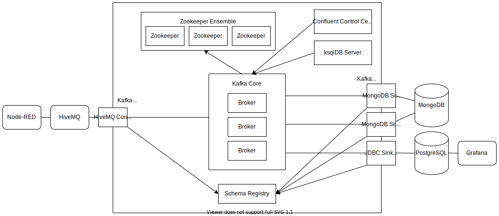
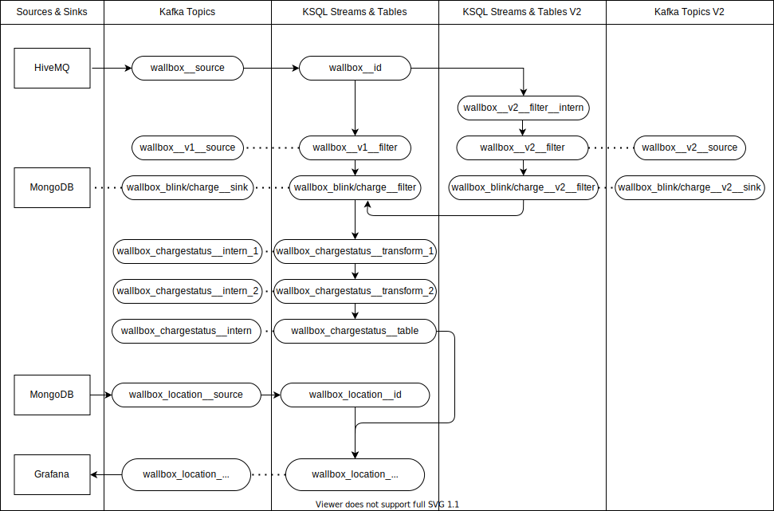
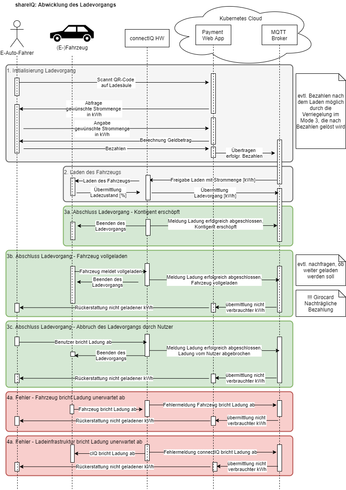

Showcase Emob
-------------

Requirements
~~~~~~~~~~~~

clone the git-repository
----
git clone https://github.com/NovatecConsulting/showcase-kafka-iot-emob.git
----

This project uses a local setup based on Docker-Compose. Therefore, in order to run this showcase on your
local machine, you need Docker and Docker-Compose which at least supports the Docker-Compose file format 2.4.

Quickstart
~~~~~~~~~~

.Change in the showcase base directory
----
cd ./showcase
----

.Build all necessary Docker images
----
./emob-dc.sh dc build
----

.Select the mode with which the showcase will then be started: 
* single (default): The showcase will be started with the additional components Lenses, Jäger and KaDeck.
* ha: The showcase will be started in high availability mode with a replication factor of three.
* showcase: The showcase will be started without Lenses, Jäger and KaDeck to reduce the setup-time.
----
./emob-dc.sh mode [singel/ha/showcase]
----

.To start the infrastructure services, deploy the application (topic creation, connectors and ksqlDB statement deployment) and import the test data in one step, run: 
----
./emob-dc.sh start all
----
.Note that this could take serveral minutes

In the following it is described how you can do this step by step:

.To start the showcase from the base directory of the showcase (showcase) and do the configuration in separate single tasks perform the following
----
./emob-dc.sh start infra
----

.Alternatively you can still use docker-compose directly (in order to start the single instance setup):
----
docker-compose up -d
# or if you want to see the output on the console
docker-compose up 
----

.You can check the health of the services with:
----
./emob-dc.sh ps
# or with plain docker-compose
docker-compose ps
----

.The startup command blocks until all services are healthy. After this you can deploy the app (which includes topic creation, connectors and ksqlDB statement deployment):
----
./emob-dc.sh start deploy
----

.Finally you can publish static test data to HiveMQ
----
./emob-dc.sh start testdata
----

* The test publishes some sample messages to different topics e.g. _CIQ000000017/out/charge_ _CIQ000000012/out/blink_ on HiveMQ broker. 

.Alternatively you can start the emob testdriver which continuously simulates 500 charging stations in Germany and publishes Mqtt messages to `*/out/charge`
----
./emob-dc.sh start testdriver
----

.You can stop the testdriver with the command:
----
./emob-dc.sh start testdriver
----

* These messages are imported to Kafka topic _wallbox__source_ with _mqtt-source_ connector. This topic can be inspected from control center http://localhost:9021/.
* The stream processor defined by the KSQL query reads imported record in _wallbox__source_, applies avro schema to it and rewrites this new record from _+/out/charge_ to topic _wallbox_charge__sink_. 
* The records in _wallbox_charge__sink_ are exported to MongoDB with _mongodb-sink_ connector. The MongoDB can be inspected with MongoDB client on _localhost:3456_. On MongoDB client, connect to MongoDB using the _Default (preconfigured)_ connection. The exported record is in collection _WallboxCharge_.
* Records in _wallbox_charge__sink_ are copied to the compacted topic _wallbox_chargestatus__intern_ to retain only the latest status for each station. 
* Locations of stations in mongoDB (which are inserted to mongoDB when starting up the showcase) are imported into Kafka topic _wallbox_location__source_ with _mongodb-source_ connector. 
* _wallbox_location__source_ and _wallbox_chargestatus__intern_ are joined with KSQL to create enriched records of _wallbox_location_chargestatus__sink_.
* The data of _wallbox_location_chargestatus__sink_ is processed by Grafana with the help of PostgreSQL and then displayed on a worldmap panel in Grafana:

      ** Access Grafana from http://localhost:3000
      ** Select the menu item "Home" on the top left corner.
      ** Select the folder "Services".
      ** Select the panel called "location_chargestatus". All the stations and their states will be displayed on the map.

.To test the setup-procedure you can invoke a kafka-console-consumer
----
kafka-console-consumer --bootstrap-server localhost:19092 --topic wallbox__source --from-beginning
----

.To test the avro schema topics you can use the kafka-avro-console-consumer
----
kafka-avro-console-consumer --bootstrap-server localhost:19092 \
    --property schema.registry.url=http://schema-registry:8081 \
    --topic wallbox_location_chargestatus__sink --property print.key=true \
    --key-deserializer=org.apache.kafka.common.serialization.StringDeserializer \
    --from-beginning
----  

.Stop the showcase 
----
./emob-dc.sh down
docker-compose down -v --remove-orphans
----

Overview of Components
~~~~~~~~~~~~~~~~~~~~~~

The showcase is using the following Kafka components as described in the picture below:

Data Flow between Topics and Ksql Streams/Tables
~~~~~~~~~~~~~~~~~~~~~~~~~~~~~~~~~~~~~~~~~~~~~~~~

Sequential Overview of Charging a Vehicle (German)
~~~~~~~~~~~~~~~~~~~~~~~~~~~~~~~~~~~~~~~~~~~~~~~~~~
[.right.text-center]

Using Node-RED for Simulation
~~~~~~~~~~~~~~~~~~~~~~~~~~~~~

You can Use the Flow-Simulation in Node-RED to simulate charging Events of electric vehicles (ev)
By importing the _connectIQ_MQTT_sim.json_ into the browser  http://localhost:1880/  based view and deploying the flow.
You can send (and receive) MQTT messages to the MQTT-Broker (HiveMQ). Node-RED simulates the Edge-Environment.

Network and Credentials
~~~~~~~~~~~~~~~~~~~~~~~

[options="header"]
.Credentials
|===
| Service | Username | Password
| hivemq  | admin    | hivemq
| KaDeck  | admin    | admin
| Lenses  | admin    | admin
|===

[cols="h,1"]
.Access to services from host
|===
| Kafka Bootstrap Server|  localhost:19092
| Schema Registry Url | http://localhost:8081
| Confluent Control Center | http://localhost:9021 
| Kafka Connect | http://localhost:8083
| KSQL server   | http://localhost:8088
| HiveMQ UI     | http://localhost:8080
| HiveMQ Broker | localhost:1883
| MongoDB client| http://localhost:3456
| Node-RED      | http://localhost:1880
| Grafana       | http://localhost:3000
| KaDeck        | http://localhost:9091
| Jaeger        | http://localhost:16686
| Lenses        | http://localhost:9991
|===

Access Services by Name
~~~~~~~~~~~~~~~~~~~~~~~

If you enable the Docker hostmanager with `./emob-dc.sh hostmanager enable`, you can access all services
with their fqdn. The domain name which is used for this project is `emob`.

[cols="h,1"]
.Access to services from host with enabled hostmanager
|===
| Kafka Bootstrap Server|  kafka.emob:9092
| Schema Registry Url | http://schema-registry.emob:8081
| Confluent Control Center | http://control-center.emob:9021 
| Kafka Connect | http://connect.emob:8083
| KSQL server   | http://ksqldb-server.emob:8088
| HiveMQ UI     | http://hivemq:8080
| HiveMQ Broker | hivemq:1883
| MongoDB client| http://mongoclient.emob:3000
| Node-RED      | http://mynodered.emob:1880
| Grafana       | http://grafana.emob:3000
| KaDeck        | http://kadeck.emob
| Jaeger        | http://jaeger.emob:16686
| Lenses        | http://lenses.emob:9991
|===

Kafka Connect Connectors
~~~~~~~~~~~~~~~~~~~~~~~~

The following Kafka connectors are used by the showcase:

- MQTT connector: https://www.confluent.io/hub/confluentinc/kafka-connect-mqtt 
- MongoDB connector: https://www.confluent.io/hub/mongodb/kafka-connect-mongodb
- Debezium MongoDB CDC Connector: https://www.confluent.io/hub/debezium/debezium-connector-mongodb

The required connectors are automatically downloaded and installed, when the Docker image for connect is created.
Which connectors are to be installed is specified in the Docker-Compose file.

----
connect:
  image: novatec/cp-kafka-connect-emob:${VERSION_CONFLUENT}
  build:
    context: .
    dockerfile: Dockerfile.connect
    args:
      VERSION_CONFLUENT: ${VERSION_CONFLUENT}
      CONNECTORS: |-
        confluentinc/kafka-connect-mqtt:1.3.0
        confluentinc/kafka-connect-jdbc:5.5.1
        mongodb/kafka-connect-mongodb:1.2.0
        debezium/debezium-connector-mongodb:1.2.2
----

If a connector is added or removed, the image can be rebuilt with the command `docker-compse build connect`.

Emob Testdriver
~~~~~~~~~~~~~~~

The Emob test driver can be configured via the Docker-Compose file link:docker-compose.testdata.yaml[].
You can, for example change the number of Stations (by default 500), and also the time range for which stations may be availabe and for which stations are in use.

The test driver is located in the directory `testdata/driver`. For more information you can have a look at the test driver link:testdata/driver/README.adoc[readme].

Monitoring
~~~~~~~~~~

In order to evaluate different monitoring and tracing tools, Jaeger Tracing, Xeotek KaDeck and Lenses are includes.
By default this tools are disabled. In order to use them, they need be activated. Extensions can only be activated, if the environment is not running.

----
./emob-dc.sh modeex setactive jaeger kadeck lenses
----

In order to disable them all, the following command can be used:

----
./emob-dc.sh modeex disable
----
