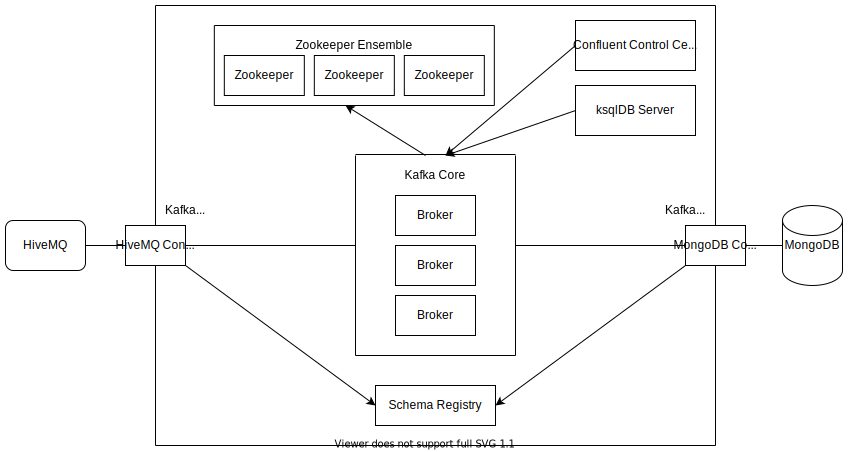
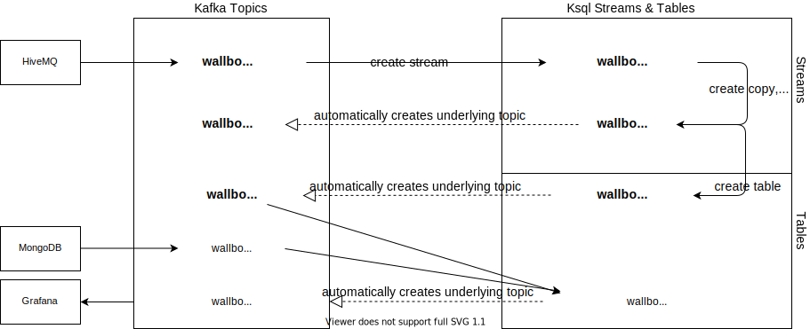

Showcase Emob
-------------

Requirements
~~~~~~~~~~~~

The following Kafka connectors are required:

- MQTT connector: https://www.confluent.io/hub/confluentinc/kafka-connect-mqtt 
- MongoDB connector: https://www.confluent.io/hub/mongodb/kafka-connect-mongodb

clone the git-repository
----
cd ./showcase
docker-compose down
rm docker-compose.yml
cd ..
git clone https://github.com/NovatecConsulting/technologyconsulting-showcase-emob.git
----

Create the showcase network
----
docker network create showcase_emob
----

Quickstart
~~~~~~~~~~
.Change in the showcase directory, create the following subfolder _/connectors/jars_ and extract the downloaded connectors to it.
----
cd ./technologyconsulting-showcase-emob
----

.Start the showcase from the base directory of the showcase (technologyconsulting-showcase-emob)
----
docker-compose up -d
or if you want to see the output on the console
docker-compose up 
----

.Wait until all components and modules (especially) _connect_ are up. Verify with 
----
docker-compose ps
----

.Configure the MQTT and MongoDB connectors and KSQL query. Verify that the following shell-scripts: setup.sh, setup-connectors.sh, setup-ksqlquery.sh are executable by chmod +x
----
chmod +x setup.sh
./setup.sh
----

.Test the end-to-end connection of two connectors (chmod +x if necessary)
----
chmod +x test-connect.sh
./test-connect.sh
----

* The end-to-end test publishes some a sample message to topic _CIQ000000017/out/charge_ on HiveMQ broker. 
 * These messages are imported to Kafka topic _wallbox_source_ with _mqtt-source_ connector. This topic can be inspected from control center http://localhost:9021/.
 * The stream processor defined by the KSQL query reads imported record in _wallbox_source_, applies avro schema to it and rewrites this new record to topic _wallbox_charge_. 
 * The records in _wallbox_charge_ are exported to MongoDB with _mongodb-sink_ connector. The MongoDB can be inspected with MongoDB client on _localhost:3000_. On MongoDB client, connect to MongoDB using the _Default (preconfigured)_ connection. The exported record is in collection _ChargingStations_.

.Stop the showcase 
----
docker-compose down
----

Overview of Components
~~~~~~~~~~~~~~~~~~~~~~

The showcase is using the following Kafka components as described in the picture below:

Data Flow between Topics and Ksql Streams/Tables
~~~~~~~~~~~~~~~~~~~~~~~~~~~~~~~~~~~~~~~~~~~~~~~~

Network and Credentials
~~~~~~~~~~~~~~~~~~~~~~~

[options="header"]
.Credentials
|===
| Service | Username | Password
| hivemq  | admin    | hivemq
|===

[cols="h,1"]
.Access to services from host
|===
| Kafka Bootstrap Server|  localhost:9092
| Schema Registry Url | localhost:8081
| Confluent Control Center | localhost:9021 
| Kafka Connect | localhost:8083
| KSQL server   | localhost:8088
| HiveMQ Broker | localhost:8080
| MongoDB client| localhost:3000
|===

